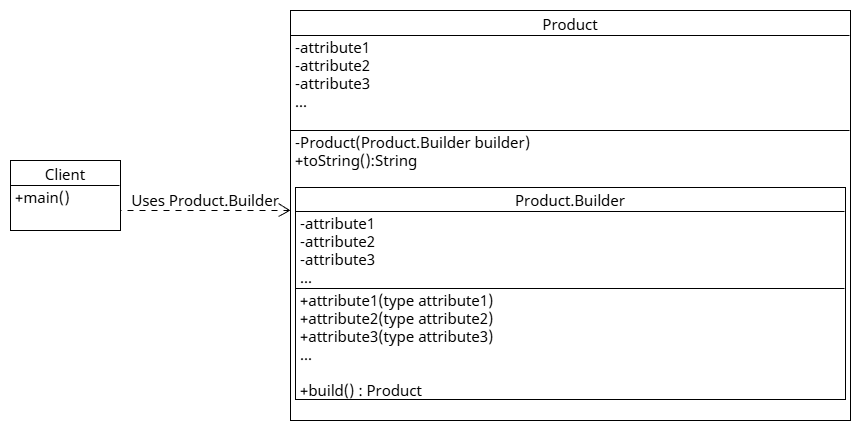

# Builder Pattern

Constructs complex objects step by step, improving readability and flexibility (and avoiding the telescoping constructor problem).

## Key Components

### Product
- The object being built. (Often paired with a static nested `Builder`, but not required.)

### Builder
- Holds construction state and provides fluent methods for setting fields.
- `build()` creates and returns the `Product`.

### Client
- Uses the `Builder` to construct a `Product` with clear, step-by-step calls.

## When to Use?
- When an object has many optional parameters or complex construction logic.
- When you want readable object creation and to enforce immutability/validation during construction.

## Examples in This Module
- `example/ex1` - Pizza with many toppings and options.
- `prac1` - User registration scenario.
- `prac2` - Car system.

## Class Diagram

