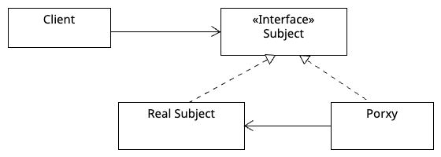

# Proxy Pattern

Provides a surrogate or placeholder for another object to control access to it.

## Key Components

### Subject
- Interface that both `RealSubject` and `Proxy` implement.
- Defines common methods.

### Real Subject
- Contains the actual business logic.
- Usually heavy or requires access control.

### Proxy
- Holds a reference to `RealSubject`.
- Adds extra behavior (logging, caching, access control, etc.) before/after delegating to `RealSubject`.

## Proxy Types
| Type | Purpose | Example |
|------|---------|---------|
| Virtual | Lazy loading | Image loading |
| Protection | Access control | Auth check |
| Caching | Cache results | API response cache |
| Logging | Log method calls | Request logging |
| Remote | Hide network communication | REST client |

## When to Use?
- When `RealSubject` is expensive to create (Virtual).
- When access control is needed (Protection).
- When caching improves performance (Caching).
- When logging/monitoring is required (Logging).
- When hiding remote communication (Remote).

## Examples in This Module
- `example/ex1` - Virtual Proxy (Image lazy loading).
- `example/ex2` - Protection Proxy (Admin access control).
- `example/ex3` - Caching Proxy (Product price cache).
- `example/ex4` - Logging Proxy (Method call logging).
- `example/ex5` - Remote Proxy (Stock service).
- `prac1` - Virtual Proxy practice.
- `prac2` - Protection Proxy practice.
- `prac3` - Caching Proxy practice.
- `prac4` - Logging Proxy practice.
- `prac5` - Remote Proxy practice.

## Class Diagram

